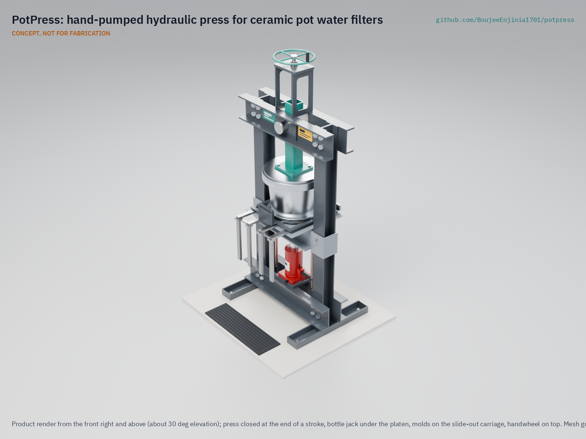
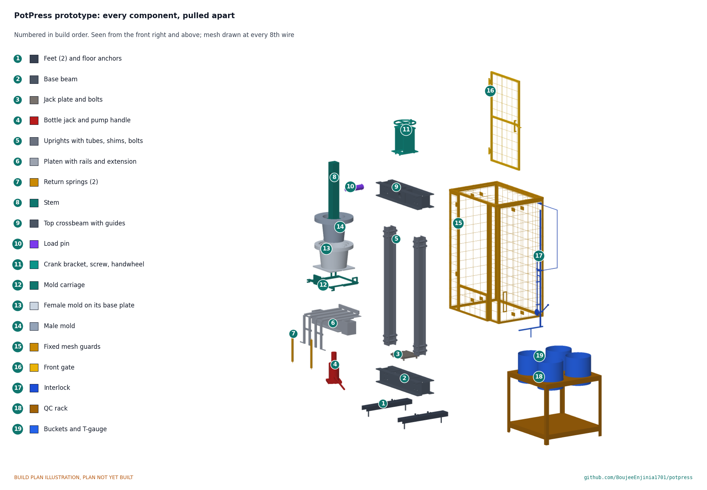

# PotPress

     

**Area:** Water Security · **TRL:** 3 of 9 (proof of concept on paper) · **Prototype budget:** $1,060 USD · **Difficulty:** 3 of 5

Hydraulic press with printable mold geometry for silver-treated ceramic pot filters, plus a QC flow-rate test jig.

[Exploded render](media/render-exploded.png) · [Gate open render](media/render-gate-open.png) · [Lineup render](media/render-lineup.png) · [Interactive 3D model](media/viewer.html) · [Concept blueprint (PDF)](media/concept-blueprint.pdf) · [General arrangement PPR-DWG-001 (PDF)](cad/drawings/PPR-DWG-001.pdf) · [Sizing note PPR-CAL-001](docs/04-calcs/01-sizing.md) · [Prototype build plan](docs/05-build-plan.md) · [Review note](docs/REVIEW.md)

## Concept rationale

The ceramic pot filter already works; what holds small factories back is the press that forms it. A hydraulic press built from standard steel channel, a car-shop bottle jack and molds cast by any aluminum foundry from 3D-printed patterns can be made and repaired in the regions where the filters are needed, instead of imported at several thousand dollars. Every dimension of the pot, the molds, the patterns and the flow gauge comes from one parametric file, so a factory that changes its filter size regenerates all of them together rather than redrawing by hand.

Keeping the design open matters because filter quality depends on details (an even wall, a consistent flow test) that each workshop now solves alone. An open, garage-buildable press lets factories, NGOs and university labs share improvements, compare results on the same geometry and build a second press when the first wears out.

## Burning platform

About 2.1 billion people still lacked safely managed drinking water in 2024, and 106 million drank untreated surface water ([WHO and UNICEF JMP, 2025](https://www.who.int/news/item/26-08-2025-1-in-4-people-globally-still-lack-access-to-safe-drinking-water---who--unicef)). WHO estimates that microbiologically contaminated drinking water causes about 505,000 diarrheal deaths each year, and that at least 1.7 billion people used a drinking water source contaminated with feces in 2022 ([WHO fact sheet, Drinking-water](https://www.who.int/news-room/fact-sheets/detail/drinking-water)).

Locally made ceramic pot filters are an established household option: filters based on the Potters for Peace technology are now made at over 50 independent factories in over 30 countries ([Potters for Peace](https://www.pottersforpeace.org/ceramic-water-filter-project)). Yet a filter press with its aluminum molds cost $3,000 to $3,500 to acquire, and a locally built Nigerian press still cost about $1,000 ([Erhuanga et al., IntechOpen, 2020](https://www.intechopen.com/chapters/71402)). The press is the gate on how many factories can start.

## Where it could be used

### By industry

| Industry | Use |
| --- | --- |
| Household water treatment enterprises | Form filters with an even wall at a small factory and check every one on the QC rack |
| Pottery and ceramics cooperatives | Add filter production to an existing kiln and clay supply with a press they can build and repair |
| Humanitarian and disaster response | Set up filter production near displaced or flood-hit communities without importing a press |
| Public health programs | Supply consistent filters to household water programs and record QC results the same way at every site |
| University and research labs | Study mix, pressing and firing variables on a repeatable press and shared geometry |
| Local fabrication shops and foundries | Build frames and cast molds from open drawings as a local service |

### By country or region

| Country or region | Why it matters there |
| --- | --- |
| Nicaragua | After Hurricane Mitch in October 1998, Potters for Peace set up its first filter production workshop here and distributed over 5,000 filters within six months ([Potters for Peace](https://www.pottersforpeace.org/ceramic-water-filter-project); [University of Pittsburgh](https://www.engineering.pitt.edu/subsites/projects/ceramic-filter/history/)) |
| Guatemala | The filter was designed here in 1981 by Dr. Fernando Mazariegos at the Central American Industrial Research Institute (ICAITI) ([Potters for Peace](https://www.pottersforpeace.org/ceramic-water-filter-project)) |
| Cambodia | One of the countries where Potters for Peace has trained filter producers ([Potters for Peace](https://www.pottersforpeace.org/ceramic-water-filter-project)); a shared press design would let new workshops match established ones |
| Nigeria | A locally built press cost about $1,000 against $3,000 to $3,500 for an imported press and molds, and the team struggled to find a lathe large enough to finish the molds ([Erhuanga et al., IntechOpen, 2020](https://www.intechopen.com/chapters/71402)) |
| United States | The University of Pittsburgh runs research and service-learning projects on filter manufacturing variables, such as sawdust particle size and firing rate, and gives technical support to NGOs that make filters ([University of Pittsburgh](https://www.engineering.pitt.edu/subsites/projects/ceramic-filter/research--activities/)); an open press gives such labs a common reference |

## What sparked the idea

The starting point was the Potters for Peace filter workshop in Nicaragua. Ron Rivera coordinated the organization's work there from 1989, and after Hurricane Mitch tore through Central America in October 1998, Potters for Peace became much more involved in the low-cost filter and set up its first filter production workshop, which distributed over 5,000 filters within six months ([University of Pittsburgh](https://www.engineering.pitt.edu/subsites/projects/ceramic-filter/history/); [Potters for Peace](https://www.pottersforpeace.org/ceramic-water-filter-project)). Its filters are formed with a hand-operated hydraulic truck jack and a two-piece aluminum mold, and filters based on that technology package are now made at over 50 independent factories in over 30 countries ([Potters for Peace](https://www.pottersforpeace.org/ceramic-water-filter-project)). PotPress takes that jack-and-mold principle and asks what it would look like as an openly maintained, parametric design, so that the next workshop can build its press and molds from shared files rather than from a one-off drawing.

## Problem

Ceramic pot filters work well, but local producers have no low-cost way to form them consistently. Imported presses cost about $3,000 to $3,500, locally built ones are one-off designs, and filter quality depends on an even wall and a consistent flow-rate check. Design with, not for: requirements must come from co-design sessions and trials with a working filter factory through a local partner.

## Concept

A 20 t bottle jack on the base lifts a guided platen carrying a cast aluminum female mold against a fixed male mold, forming one filter (280 mm inner rim, 9.9 L working volume) per stroke. The male mold is held by one 60 mm load pin in the top crossbeam for pressing and raised by a hand crank for loading, and the female mold slides out on a carriage for demolding. One parametric filter geometry drives the molds, their 3D-printed casting patterns and a printed T-gauge for the four-station, one-hour flow-rate test rack. TRL 3 calculations: a cycle of about 5.2 min and about 69 pots per 6 h, a frame that stays below yield at 1.5 times the jack rating, 0.66 mm of deflection between the molds at the 10 t working force, every part under 40 kg with the upright joints bolted, and, with the fixed mesh guards and interlocked front gate decided by Amish on 2026-09-26, $1,051 in parts against the $1,060 budget, which Amish raised from $990 on 2026-09-27 to cover the guards. Making the design constructable on 2026-09-30 raised the parts to about $1,143, which is over that budget and proposed for Amish's decision (see the [review note](docs/REVIEW.md)).

Full design precis: [docs/02-concept.md](docs/02-concept.md)

## Key components

- Steel channel frame in welded subassemblies: two UPN 160 beams and back-to-back UPN 100 uprights, bolted at the upright joints with 4 x M16 10.9 each, with spacer tubes and shims
- 20 t bottle jack, guided moving platen and return springs
- Cast aluminum shell molds (female 36.5 kg on its steel base plate, male 23 kg), cast from 3D-printed flat-back patterns and located by two dowels
- Mold carriage on slide rails with a hinged front extension that folds down, and male mold slide with hand crank, one load pin and a pin-presence interlock
- Four-station (2 x 2) QC flow-test rack with printed T-gauges and collection buckets

The working bill of materials is in [bom/bom.csv](bom/bom.csv).

## Building the prototype

The [prototype build plan](docs/05-build-plan.md) (PPR-BLD-001, plan, not yet built) shows how to make each component and fit it to the next, in 14 making sketches, 11 joint close-ups and 18 assembly steps drawn from the model. The frame, platen, carriage and guards are sawn, drilled and stick welded from steel channel, plate and galvanized mesh; the two molds are sand cast by a local foundry from 3D-printed flat-back patterns and lead-free scrap, then lapped and hand finished, with no lathe needed. Writing the plan made the design constructable: seventeen changes, such as an open-topped male mold, dowel location for the molds, M16 joint bolts with spacer tubes and a floating lead screw nut, are recorded in [PPR-DDR-004](docs/decisions/0004-design-for-construction.md). The parts now cost about $1,143, over the $1,060 budget, which is proposed for Amish's decision.

## Safety

> **Safety:** Hydraulic presses store significant energy. Guard pinch points, press only with the gate closed and the load pin fully home (the interlock enforces this), and never exceed the jack rating. Molds are heavy; clay dust contains silica; silver compounds are corrosive. Passing the flow test does not prove a filter removes pathogens. See the safety section of the [design precis](docs/02-concept.md).

## Repository layout

| Folder | Contents |
| --- | --- |
| `docs/` | Problem, concept, requirements, calculations and design decisions |
| `cad/src/` | build123d Python source, the source of truth for all geometry |
| `cad/step/`, `cad/stl/` | Exported models for FreeCAD, other CAD tools and printing |
| `cad/drawings/` | 2D sketches and dimensioned drawings |
| `bom/` | Bill of materials |
| `electronics/` | KiCad schematics and PCB layouts |
| `firmware/` | Microcontroller code |
| `media/` | Renders, perspectives and photos |
| `build-log/` | Dated prototyping notes |

## Documentation

Controlled documents follow the portfolio [documentation standard](.kit/STANDARDS.md). Each carries a document ID (PPR-PRC-001 for the precis), a version and a revision history. Branded PDFs are built with `python .kit/render.py` and attached to GitHub Releases when a document is tagged, for example `PPR-PRC-001/v1.0`.

## Credits

Designed by Amish Chadha. See [CONTRIBUTORS.md](CONTRIBUTORS.md) for roles. To cite this design, use [CITATION.cff](CITATION.cff) (GitHub shows it as "Cite this repository").

AI assistance (Claude) was used to accelerate concept renders, prototype documentation and first-pass sizing calculations. Design direction and all decisions are Amish Chadha's, recorded in this repository's decision records (`docs/decisions/`).

## Licenses

- **Hardware** (CAD, drawings, BOM, electronics): [CERN-OHL-S v2](LICENSE)
- **Software** (firmware, scripts, notebooks): [MIT](LICENSE-SOFTWARE)

A project of the [Design Molecule](https://designmolecule.com) lab.
