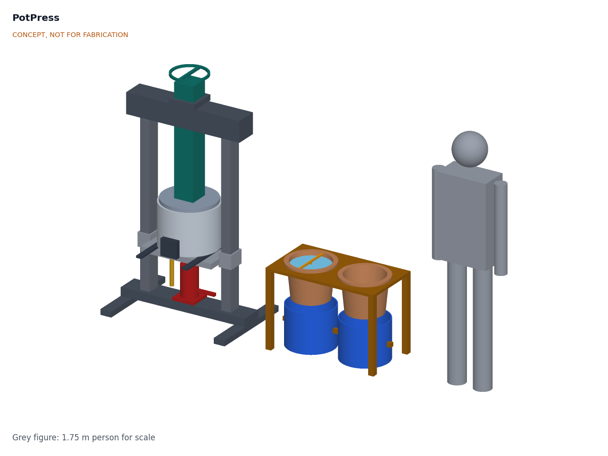
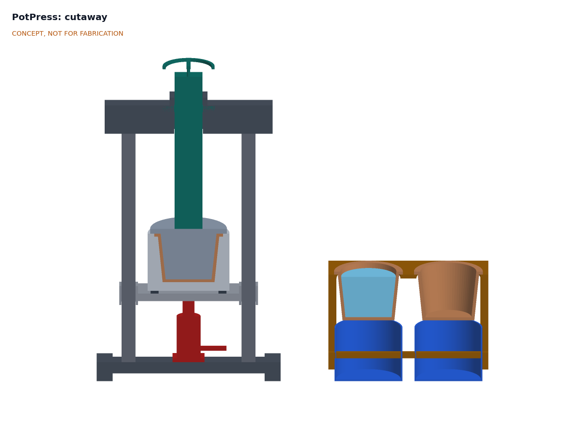
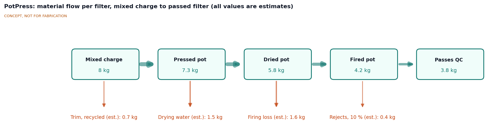
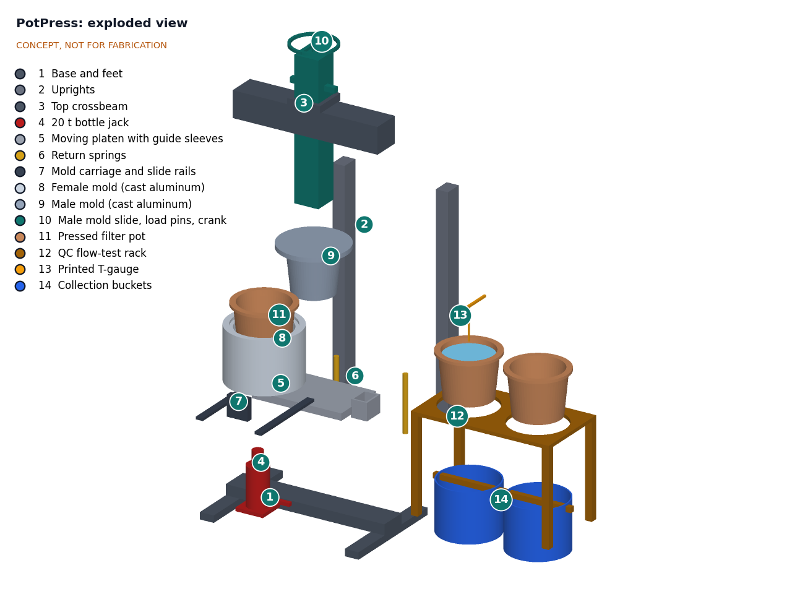

# PotPress design precis

PotPress is a hand-pumped hydraulic press that forms one ceramic pot filter per stroke between a cast aluminum female mold and male mold, plus a four-station rack for the standard one-hour flow-rate test. A 20 t bottle jack on the base lifts a guided platen carrying the female mold against a fixed male mold, whose stem is pinned to the top crossbeam for pressing and raised by a hand crank for loading. One parametric filter geometry drives the molds, the 3D-printed casting patterns and the printed flow gauge. First-order numbers suggest a cycle of about 5 min, 50 or more pots per shift and a parts cost of about $716, about 19 % over the $600 target.

*Figure 1. PotPress with the QC flow-test rack and a 1.75 m person for scale. The press is shown closed at the end of a pressing stroke.*

## How it works

1. **Load.** The operator lays a polyethylene release liner in the female mold, places a weighed charge of about 8 kg of clay, burnout and water mix, and slides the mold carriage in along its rails until it hits the end stop under the male mold.
2. **Lower the male mold.** A hand crank on top of the frame runs the male mold stem down through the top crossbeam guide until its load pins drop into their slots. From then on the pins, not the screw, carry the press force into the crossbeam.
3. **Press.** The operator closes the front gate and pumps the jack. The platen, guided by sleeves on both uprights, lifts the female mold and squeezes the charge into the gap between the molds. The male mold's flange forms the flat rim. Excess mix squeezes out at the rim for trimming.
4. **Open and demold.** The operator opens the jack release valve; return springs pull the platen down. The crank lifts the male mold about 200 mm, clear of the rim, the carriage slides out toward the operator and tilts on its pivot so the pot, still in its liner, turns out onto a drying board.
5. **Dry, fire, treat.** Drying, firing and silver treatment follow the factory's existing practice and are outside PotPress.
6. **Test.** Fired pots are soaked, set in the QC rack over collection buckets, filled to the rim and read after one hour with the printed T-gauge, whose scale in liters is generated from the same filter geometry.

*Figure 2. Cutaway through the closed press and the QC rack, showing the pressed pot between the molds and a test pot full of water.*

*Figure 3. Material flow for one filter, from mixed charge to a filter that passes QC, in kg. All values are estimates.*

## Main components

Numbers match the exploded view (Figure 4) and `bom/bom.csv`.

| # | Component | Proposed choice | Notes |
| --- | --- | --- | --- |
| 1 | Base and feet | UPN 100 crossbeam on two 640 mm channel feet | Wide feet resist tipping; bolt holes for floor anchors |
| 2 | Uprights | Back-to-back UPN 100 pairs, about 1.2 m | Carry the press force in tension |
| 3 | Top crossbeam | Two UPN 160 channels with a square guide collar | Takes the full press load in bending |
| 4 | 20 t bottle jack | Standard jack, about 150 mm stroke | Common, cheap, locally replaceable |
| 5 | Moving platen | 20 mm plate with sleeves riding on the uprights | Keeps the molds coaxial (R2) |
| 6 | Return springs | Two tension springs | Retract the platen and jack ram |
| 7 | Mold carriage | Slide rails, end stops, tilt pivot, pull handle | Moves the female mold out of the pinch zone for loading |
| 8 | Female mold | Cast aluminum shell, about 20 kg | Cast from a printed pattern |
| 9 | Male mold | Cast aluminum plug with rim flange, about 12 kg | Cast from a printed pattern |
| 10 | Male mold slide | Square stem, hand-crank lead screw, two load pins | Screw only lifts; pins carry the load |
| 11 | Pressed filter pot | The product, shown for context | Not costed |
| 12 | QC flow-test rack | Four stations, steel angle or hardwood | Two stations modeled |
| 13 | Printed T-gauge | PETG dipstick with a scale in L/h | Scale generated from the geometry |
| 14 | Collection buckets | 20 L food-grade polyethylene | |

Casting patterns, guards and front gate, release liners, fasteners and the QC timer and thermometer are in the BOM as items 15 to 19 but not modeled.

*Figure 4. Exploded view with numbered callouts matching the BOM.*

## First-order numbers

All values are estimates for concept review and will be checked at TRL 3.

### Filter geometry and charge

Assumptions: inner rim diameter 280 mm, inner depth 240 mm, wall 15 mm, flat rim 345 mm across, pressed mix density about 1.7 kg/L, and a recipe of about 59 % clay, 16 % rice husk and 25 % water by mass (the RDI-C recipe reported by [Rayner, 2009](https://bdd.pseau.org/outils/ouvrages/wedc_current_practices_in_manufacturing_locally_made_ceramic_pot_filters_2009.pdf)).

| Quantity | Estimate | Basis |
| --- | --- | --- |
| Volume to the brim | about 12.3 L | Frustum, radii 115 and 140 mm, depth 240 mm |
| Working volume | about 10 L | Filled to about 40 mm below the rim; close to the 9.84 L Cambodian filter |
| Wall and rim volume | about 4.2 L | Wall 15 mm over about 0.23 m², plus rim |
| Pressed pot mass | about 7.3 kg | 4.2 L x 1.7 kg/L |
| Charge | about 8.0 kg | Pressed pot plus about 0.7 kg trim, which is recycled |
| Fired pot | about 4.2 kg | Loses drying water (about 1.5 kg), burnt-out husk, residual water and bound water in the clay (about 1.6 kg) |

The 8 kg charge matches the 8 to 9.5 kg reported by factories (Rayner, 2009).

### Force and pressure

The pressing force needed for a well-consolidated wall was not found in the sources reviewed. Factories use a 20 t jack ([IntechOpen chapter](https://www.intechopen.com/chapters/71402)), so PotPress assumes a working force of 5 to 10 t and designs the frame for the full jack rating times 1.5.

| Quantity | Estimate | Basis |
| --- | --- | --- |
| Projected area of the pot | about 0.093 m² | Rim diameter 345 mm |
| Mean pressure at 5 to 10 t | about 0.5 to 1.1 MPa | 49 to 98 kN over 0.093 m² |
| Mean pressure at the 20 t rating | about 2.1 MPa | 196 kN |
| Design load | 294 kN | 1.5 x the jack rating (R3) |
| Top beam bending moment | about 29 kN·m at 196 kN, about 44 kN·m at 294 kN | Center load, 600 mm span |
| Top beam stress, two UPN 160 (about 232 cm³) | about 127 MPa at 196 kN, about 190 MPa at 294 kN | Below 275 MPa yield for S275 |
| Upright stress | about 54 MPa at 294 kN | 147 kN per side over two UPN 100 (2,700 mm²) |
| Load pin shear | about 104 MPa at 294 kN | Two 30 mm pins in double shear |

The frame is not the hard part; alignment is. Wall evenness (R2) depends on the guide sleeves keeping the molds coaxial to within about 0.5 mm under load, which is a TRL 3 task.

### Travel and cycle

| Quantity | Estimate | Basis |
| --- | --- | --- |
| Relative travel to open the molds | about 270 mm | 240 mm plug depth plus 30 mm clearance (R5) |
| Jack pressing travel | about 80 to 120 mm | Charge first touches the male mold to fully closed |
| Crank lift | about 200 mm | Remainder, with margin; about 40 turns of a 5 mm pitch screw |
| Cycle time | about 5 min | Load 1 min, crank 1 min in total, press and dwell 1.5 min, demold and trim 1.5 min |
| Output | about 70 pots per 6 h of pressing | With one operator preparing the next charge in parallel (R4) |

A standard bottle jack's stroke of about 150 mm cannot open the molds by itself, which is why the male mold has its own lift. The alternative is a long-stroke cylinder (see Key design choices).

### Flow-rate QC

| Quantity | Estimate | Basis |
| --- | --- | --- |
| Water surface area near the rim | about 0.062 m² | Radius about 140 mm |
| Level drop for 1.0 L | about 16 mm | 1.0 L / 0.062 m² |
| Level drop for 2.5 L | about 41 mm | Area shrinks slightly with depth |
| Gauge resolution | 0.1 L is about 1.6 mm | Readable with printed ticks, but tight (R6) |
| Temperature effect | about 2 to 3 % per °C near 25 °C | Viscosity of water; 20 °C water flows about 20 % slower than 30 °C water |

Flow measured in cold morning water and warm afternoon water can differ by more than the width of the acceptance band, so the gauge sheet carries a correction to 25 °C (proposed).

### Cost

| Group | Items | Indicative cost |
| --- | --- | --- |
| Press | 1 to 10, 15 to 18 | about $645 |
| QC rack | 12 to 14, 19 | about $71 |
| **Total** | | **about $716**, R10 ($600) not met |

The molds and their patterns (items 8, 9 and 15) are about $255, more than a third of the total.

## Key design choices

Every choice below is **Proposed, awaiting Amish**.

- **Jack below, pushing the female mold up.** A bottle jack must stand upright, so it sits on the base and lifts the platen, and the male mold hangs from the top beam. Alternatives: a jack rated for inverted use pushing the male mold down (fewer moving parts under the mold, but costlier and less common), or a screw press as used by some factories (no hydraulics, slower, more operator effort). Recommendation: jack below.
- **Male mold lift by hand crank with load pins.** Options: (a) crank and pins as modeled (cheap, uses a standard jack, one more step per cycle); (b) a 20 t long-stroke cylinder with a separate hand pump giving about 270 mm of travel (simpler cycle, about $150 to $250 more, less common locally); (c) a counterweighted lever. Recommendation: (a).
- **Molds cast in aluminum from printed patterns.** Options: (a) cast aluminum as modeled (durable, proven by the Nigerian press, needs a foundry and finishing); (b) printed shells backed with fiber-reinforced concrete and an epoxy face (about $115 cheaper, which brings the total close to $600, but durability under daily pressing is unknown); (c) fabricated steel (heavy and needs rolling). Recommendation: (a), with (b) built as a low-cost variant for comparison.
- **Welded frame.** Welding a standard channel frame is within the skills of a local fabrication shop. A bolted frame is the alternative where no welder is available. Recommendation: welded, with a bolted variant documented later.
- **Demold by sliding out and tilting the carriage.** Options: tilt-and-invert onto a board (recommended; keeps hands out of the press), air-assisted release through a port in the female mold, or leaving the pot on the male mold. Lifting about 27 kg of mold and pot by hand is to be avoided.
- **Manual QC rack with printed T-gauge.** A load-cell logger per station (about $40 more each) would log results automatically but adds electronics. Recommendation: manual first; logger as a later option.
- **Default acceptance band 1.0 to 2.5 L/h, corrected to 25 °C.** Each factory sets its own band; the gauge prints whichever band it chooses.
- **Budget.** The total is about $116 over the $600 target. Options are in `docs/REVIEW.md`. The `project.yaml` budget is unchanged.

## Safety

> **Safety:** PotPress is a 20 t hydraulic press with heavy moving parts, and the workshop around it handles silica-bearing clay dust and silver compounds. Treat each of these as a hazard at every stage.

- **Crushing and pinch points.** The gap between the molds, the platen and the uprights, and the carriage rails can crush fingers and hands. Press only with the side guards on and the front gate closed; the jack pump and release valve sit outside the guard; the carriage has end stops so it cannot be pushed under a moving mold.
- **Stored energy and overload.** Never exceed the jack rating, never add a cheater bar to the pump handle, and never press without both load pins fully home. A pin that shears or walks out can eject at speed. The jack's own relief valve must not be adjusted. Release pressure fully before opening the gate.
- **Falling and tipping.** The molds weigh about 12 and 20 kg and the press about 180 kg with a tall frame. Anchor the base to the floor or use the wide feet on a level slab, lift molds with two people, and wear safety boots.
- **Silica dust.** Dry clay and rice husk ash contain crystalline silica, which causes silicosis. Keep mixing and trimming wet, sweep damp, and wear a fitted P2 or N95 respirator for dry work.
- **Silver compounds.** Silver nitrate is corrosive to skin and eyes and toxic to aquatic life; colloidal silver solutions must be handled with gloves and eye protection and never poured into waterways. Silver treatment is outside PotPress but happens in the same workshop.
- **Heat.** Kilns reach about 900 °C. Kilns are outside PotPress but share the site.
- **Water safety claims.** PotPress makes consistent pots; it does not certify them. A filter that passes the flow test is not proven to remove pathogens. Factories must verify bacteria removal by laboratory testing and follow the CMWG recommendations.

## Open questions for TRL 3

- What pressing force gives a well-consolidated wall with a typical mix? Ask a partner factory, or estimate from clay forming data.
- Design the guide sleeves and mold spigots for coaxial alignment within 0.5 mm under load (R2).
- Confirm the lift arrangement and jack stroke (R5) and check platen and beam deflection.
- Split the casting patterns for a 250 mm printer bed, and work out cavity finishing without a large lathe (R7).
- Confirm the demolding method with potters; check whether a liner leaves marks that affect flow.
- Close the $116 cost gap or propose a budget change.
- Choose the first partner factory or organization.

Concept media: [blueprint sheet](../media/concept-blueprint.pdf), [interactive 3D model](../media/viewer.html).
